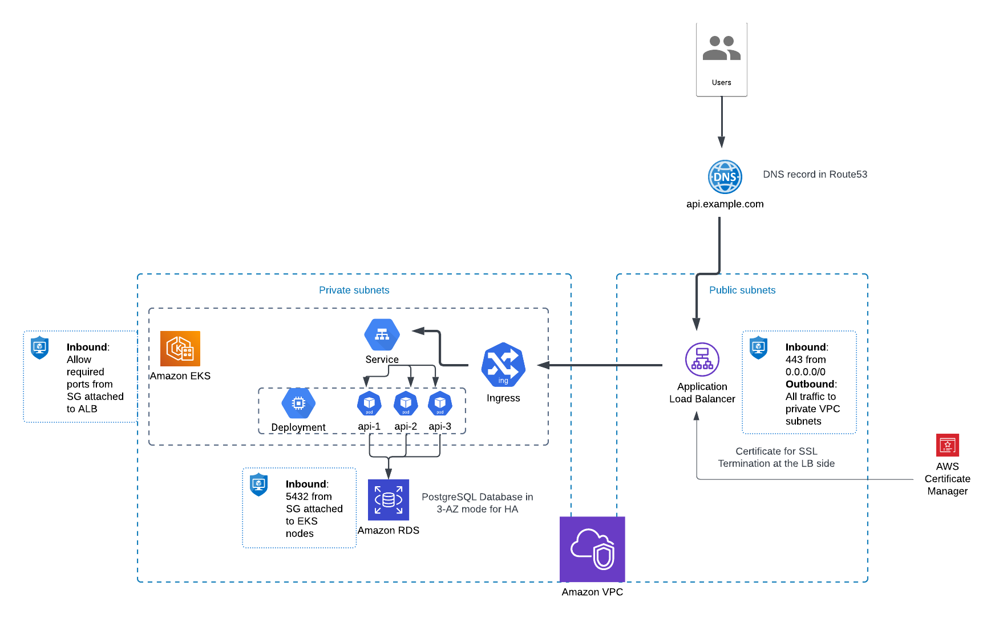

# Test API application

## Notes

CI&CD process is missed for the project. It should contain the following steps:

- code linting
- build Docker image
- run unit tests
- push Docker image
- create and push Helm chart
- deploy Helm chart to different environments
- creation of required resources in AWS can be a part of the pipeline as well
- etc.

## AWS system diagram



## Local development & deployment

Prerequisites
- Docker
- Docker Compose

To start the application, run the following command:
```shell
docker-compose up
```

Once the application is running, it will be accessible at: http://localhost:8888 

## Local testing

1. Deploy the application using Docker Compose. 
2. Set up the environment:
```shell
python3 -m venv .venv
source .venv/bin/activate
pip install -r requirements-tests.txt
```
3. Run unit tests:
```shell
python tests/unit.py
```

## Kubernetes deployment

0. Go to the directory with the Helm chart.
1. Set required variables in `values.yaml`.
2. Run Helm installation for the required namespace of K8s cluster in dry-run mode:
```shell
helm upgrade --install -n my-api --dry-run -f values.yaml helm-api .
```
3. Analyse outputs and run the deployment if all good:
```shell
helm upgrade --install -n my-api -f values.yaml helm-api .
```